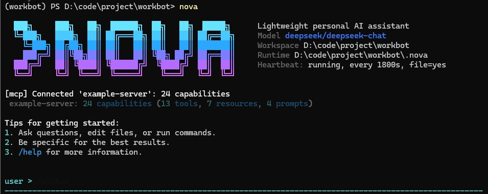

<div align="center">
  <h1>NOVA: A lightweight personal AI assistant</h1>
  <p>
    
    
    
    
    
  </p>
</div>

NOVA is a lightweight personal AI assistant designed to handle a wide range of tasks, including software development, workspace automation, knowledge retrieval, and interactive terminal workflows. It integrates tool calling, file operations, task tracking, background execution, isolated subagents, native MCP connectivity, and intelligent memory management powered by Mem0.

<p align="center">
  
</p>

> [!NOTE]
> NOVA is provider-agnostic through [LiteLLM](https://github.com/BerriAI/litellm), so you can plug in OpenAI, Anthropic, DeepSeek, Ollama, and other supported backends without rewriting the agent loop.

## ✨ Highlights

⚙️ **Coding-first workflow**: built around terminal interaction, code inspection, file operations, and developer tooling rather than chat-only usage.  
🧠 **Mem0-powered memory**: supports structured long-term memory with semantic retrieval, scoped storage, snapshot export, and migration from the older Markdown flow.  
🛰️ **Isolated subagents**: delegate exploration, review, or implementation work to focused subprocess-style agents with scoped capabilities.  
🛡️ **Permission-aware execution**: sensitive actions flow through an approval system with workspace-aware safeguards and shell deny rules.  
🔌 **Native MCP support**: connect external capabilities through the Model Context Protocol without bolting on a separate orchestration layer.  
🧩 **Extensible by design**: add `SKILL.md` knowledge packs, custom tools, and new integrations without reworking the core loop.  
📦 **Small but capable core**: NOVA stays modular and readable while still shipping 25+ built-in tools for practical automation.

## 🧭 What NOVA Is Optimized For

- Personal coding assistance in a local workspace
- Iterative software development from the terminal
- Project-aware memory and retrieval
- Safe execution of developer tools
- Building custom assistant behaviors without heavyweight frameworks

## 🏗️ Architecture

```text
nova/
├── config.py                # Environment, paths, global constants
├── agent/
│   ├── loop.py              # Main turn orchestration
│   ├── runner.py            # Shared tool / model execution loop
│   ├── context.py           # System prompt assembly and context injection
│   ├── compression.py       # Context compaction and summaries
│   ├── memory.py            # Memory consolidation pipeline
│   ├── memory_backend.py    # Backend abstraction: markdown / mem0 / hybrid
│   ├── mem0_backend.py      # Mem0 + Qdrant integration
│   └── memory_snapshot.py   # Readable memory snapshot export
├── cli/
│   └── repl.py              # Interactive REPL and command surface
├── subagent/
│   ├── runner.py            # Isolated subagent execution
│   └── capabilities.py      # Capability presets
├── permissions/
│   ├── manager.py           # Approval gate and rule handling
│   └── defaults.py          # Seed allow / deny policy
├── tools/
│   ├── base.py              # BaseTool contract
│   ├── orchestration.py     # Tool dispatch layer
│   ├── registry.py          # Tool registration and runtime wiring
│   └── builtin/             # Core tools
├── mcp/
│   ├── client.py            # MCP client bridge
│   └── loader.py            # MCP capability loading
├── tasks/                   # Persistent tasks and todo management
├── background/              # Background job execution
├── session/                 # Session persistence
├── skills/                  # Skill loading
├── cron/                    # Scheduled jobs
├── heartbeat/               # Periodic assistant ticks
└── providers/               # LLM provider abstraction
```

## 🧠 Memory System

NOVA implements a Mem0-based memory management mechanism for long-term knowledge storage, retrieval, and maintenance. Markdown files are still retained as a practical fallback and readable snapshot layer, but the primary memory design is centered on Mem0.

### Memory scopes

NOVA organizes memory into three scopes:

- `user`: durable preferences, stable habits, user-specific facts
- `project`: long-lived context tied to the current workspace or codebase
- `session`: shorter-lived context tied to the active conversation

### Retrieval model

Memory retrieval is not limited to keyword matching. Before generating a response, NOVA can search across `user`, `project`, and `session` scopes through the Mem0 backend, combining semantic retrieval with hybrid ranking when available, then inject the results as data context for the current turn.

### Memory operations available today

- Automatic memory consolidation from ongoing work
- Async write path for Mem0-backed storage
- Snapshot export for readable inspection
- Markdown fallback for safety and operator-friendly inspection
- Memory status inspection from the CLI
- Model-callable memory tools for controlled browsing and deletion

### LLM-facing memory tools

NOVA exposes dedicated built-in tools for explicit memory operations:

- `search_memories`
- `get_memories`
- `get_memory`
- `delete_memory`

These are built into NOVA directly rather than being served by a separate memory MCP layer.

## 🚀 Install & Quick Start

> [!IMPORTANT]
> NOVA requires a valid model provider key. The main chat model is configured separately from optional Mem0 LLM and embedder settings.

### 1. Install from source

```bash
pip install -e .
```

### 2. Create a `.env`

```env
MODEL_ID=deepseek/deepseek-chat
API_KEY=your-api-key-here
API_BASE=https://api.deepseek.com
```

### 3. Launch

```bash
nova
```

`python -m nova` also works.

<details>
<summary><b>Optional: Mem0 configuration</b></summary>

```env
NOVA_MEMORY_BACKEND=mem0
NOVA_USER_ID=local-user
NOVA_MEMORY_SEARCH_LIMIT=6
NOVA_MEMORY_SEARCH_TIMEOUT_MS=1200
NOVA_MEMORY_WRITE_MODE=async

MEM0_QDRANT_HOST=localhost
MEM0_QDRANT_PORT=6335
MEM0_COLLECTION=nova_memories
MEM0_ENABLE_GRAPH=false
MEM0_SNAPSHOT_LIMIT=80

MEM0_LLM_PROVIDER=
MEM0_LLM_MODEL=
MEM0_LLM_API_KEY=
MEM0_LLM_BASE_URL=

MEM0_EMBEDDER_PROVIDER=
MEM0_EMBEDDER_MODEL=
MEM0_EMBEDDER_API_KEY=
MEM0_EMBEDDER_BASE_URL=
MEM0_EMBEDDER_DIMS=
```

Notes:

- Mem0 LLM settings should be managed separately from the main chat model.
- The embedder endpoint should not blindly reuse the primary chat `API_BASE`.
- `MEM0_EMBEDDER_DIMS` should match the actual dimension of the selected embedding model.

</details>

<details>
<summary><b>Supported model ID examples</b></summary>

| Provider | Example |
|----------|---------|
| DeepSeek | `deepseek/deepseek-chat` |
| OpenAI | `openai/gpt-4o` |
| Anthropic | `anthropic/claude-sonnet-4-20250514` |
| Ollama | `ollama/llama3` |

</details>

## 💬 CLI Reference

NOVA ships with an interactive REPL and a focused command surface:

| Command | Description |
|---------|-------------|
| `/new` | Start a fresh conversation |
| `/sessions` | List saved sessions |
| `/resume <#\|key>` | Resume a previous session |
| `/compact` | Compress conversation context |
| `/memory` | Run memory consolidation now |
| `/memory status` | Show backend health and memory write status |
| `/memory export` | Export a readable memory snapshot from Mem0 |
| `/memory migrate` | Migrate legacy Markdown memory into Mem0 |
| `/dream-log` | Show the latest Dream memory change |
| `/dream-restore` | Restore a previous Dream memory version |
| `/cron` | Inspect or manage scheduled jobs |
| `/heartbeat` | Trigger one heartbeat tick |
| `/mcp` | Show connected MCP servers and capabilities |
| `/tasks` | Show the task board |
| `/bg` | Inspect background tasks |
| `/subagents` | Inspect or control isolated subagents |
| `/permissions` | Show current permission rules |
| `/status` | Show session, model, and runtime status |
| `/help` | Print the command manual |
| `/exit` | Quit the REPL |

## 🧰 Built-in Tools

NOVA currently includes 25+ built-in tools across the following categories:

| Category | Tools |
|----------|-------|
| Shell & jobs | `bash`, `background_run`, `check_background`, `task_output` |
| Filesystem | `read_file`, `write_file`, `edit_file`, `list_dir` |
| Tasks | `task_create`, `task_get`, `task_update`, `task_list`, `claim_task`, `TodoWrite` |
| Subagents | `task`, `check_subagent`, `list_subagents`, `control_subagent`, `wait_subagent` |
| Memory | `search_memories`, `get_memories`, `get_memory`, `delete_memory`, `compress` |
| Other | `load_skill`, `ask_user`, `cron` |

## 🛡️ Permission Model

Sensitive tools such as shell execution, file writes, edits, and background jobs run through a permission layer before they execute.

Key ideas:

- workspace-local writes can be handled more smoothly than out-of-scope changes;
- shell commands are checked by program rather than trusted wholesale;
- dangerous patterns can be denied before they ever reach the shell;
- chained commands are inspected segment-by-segment rather than treated as a single opaque string.

This keeps NOVA practical for real work while still reducing avoidable risk.

## 🔌 MCP Support

NOVA natively supports the Model Context Protocol and can load external capabilities from MCP servers. The MCP configuration uses `mcpServers` as the canonical top-level key.

```json
{
  "mcpServers": {
    "everything": {
      "type": "stdio",
      "command": "npx",
      "args": ["-y", "@modelcontextprotocol/server-everything"],
      "env": {},
      "toolTimeout": 30,
      "enabledTools": ["*"]
    }
  }
}
```

## 🧩 Extensibility

### Add skills

NOVA can absorb custom knowledge from `SKILL.md` files, making it easy to teach repeatable workflows, domain rules, and response patterns without editing the agent core.

```markdown
---
name: summarize-skill
description: Teaches NOVA a standard summarization workflow
---

# Instructions
...
```

### Add Python tools

```python
from nova.tools.base import BaseTool

class SuperTool(BaseTool):
    name = "super_tool"
    description = "A custom tool doing awesome stuff."
    parameters = {"type": "object", "properties": {}}

    def execute(self, **kwargs):
        return "Awesome stuff done!"
```

Register the tool in `nova/tools/registry.py`.

## ✅ Testing

Run the default test suite with:

```bash
python -m unittest discover -s tests -v
```

If you are validating live Mem0 integration, make sure the configured Qdrant instance and memory provider settings are available first.

## 📄 License

[MIT License](./LICENSE)